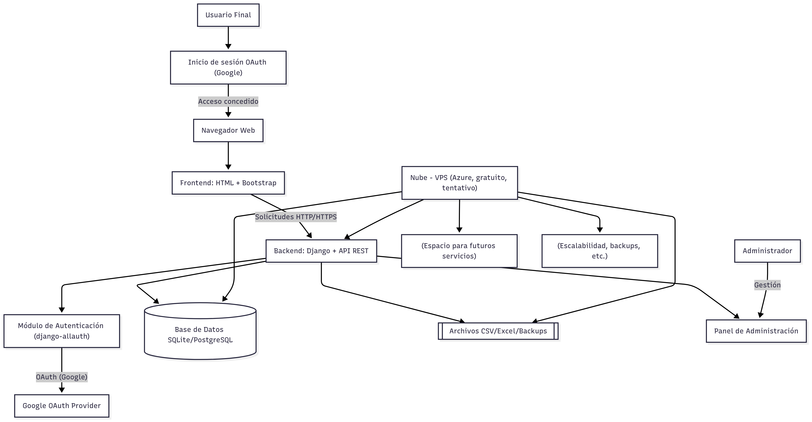
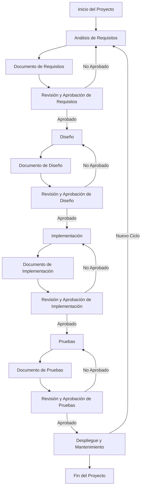

# ProyectoTesis

Este proyecto es una plataforma para la gestión de activos, desarrollada con Django para el backend y una estructura de frontend basada en templates HTML. Incluye manejo de datos y una arquitectura modular.

## Estructura del Proyecto

```
ProyectoTesis/
│
├── backend/         # Proyecto Django
│   ├── manage.py
│   ├── activos/     # App principal para gestión de activos
│   └── config/      # Configuración del proyecto Django
│
├── frontend/        # Archivos estáticos y templates
│   ├── templates/   # HTML para la interfaz de usuario
│
├── data/            # Archivos de datos (CSV, Excel)
│   ├── data.csv
│   └── data.xlsx
│
├── requirements.txt # Dependencias del proyecto
└── README.md        # Este archivo
```

## Descripción

La aplicación permite gestionar activos, almacenando información relevante como tipo, nombre, ubicación, cantidad y código. Utiliza Django como framework principal y organiza la lógica en una app llamada `activos`. 

El frontend está construido con templates HTML y utiliza el framework de estilos Bootstrap para una interfaz moderna y responsiva.

## Instalación

1. Clona el repositorio:
   ```bash
   git clone https://github.com/N0D3TR4CK3R/ProyectoTesis.git
   cd ProyectoTesis
   ```
2. Crea y activa un entorno virtual (opcional pero recomendado):
   ```bash
   python -m venv venv
   # En Windows:
   venv\Scripts\activate
   # En Linux/Mac:
   source venv/bin/activate
   ```
3. Instala las dependencias:
   ```bash
   pip install -r requirements.txt
   # Dependencias adicionales para OAuth:
   pip install requests pyjwt cryptography
   ```
4. Aplica migraciones y ejecuta el servidor:
   ```bash
   cd backend
   python manage.py migrate
   python manage.py runserver
   ```

## Autenticación OAuth

El proyecto soporta autenticación OAuth mediante Google usando django-allauth. Para configurarlo:
- Crea un proyecto en Google Developers Console y obtén el Client ID y Client Secret.
- Registra la aplicación en el admin de Django (sección Social Applications).
- Accede a `/accounts/login/` para probar el flujo de autenticación.

## Uso

- Accede a la interfaz web en `http://127.0.0.1:8000/`.
- Gestiona activos desde la app principal.
- Los datos pueden ser exportados/importados desde la carpeta `data/`.

## Arquitectura

El proyecto sigue una arquitectura modular:
- **Backend:** Django, app `activos`, base de datos SQLite.
- **Frontend:** Templates HTML con Bootstrap.
- **Datos:** Archivos CSV y Excel.

## Diagrama de Arquitectura

A continuación se muestra el diagrama de arquitectura actualizado:



> **Nota:** El diagrama Mermaid detallado se encuentra en `assets/diagrama_mermaid.txt` para referencia y edición futura.

## Ciclo de Entregables y Revisiones en la Metodología en Cascada

El siguiente diagrama ilustra cómo, en cada fase del ciclo en cascada, se generan entregables documentales que deben ser revisados y aprobados antes de avanzar. Si un entregable no es aprobado, el ciclo se reinicia desde la fase correspondiente. Esto asegura la calidad y el cumplimiento de los requisitos en cada etapa del desarrollo.



## Metodología de Desarrollo

Este proyecto utiliza la **metodología de desarrollo en cascada**, que se caracteriza por un proceso secuencial de fases: análisis de requisitos, diseño, implementación, pruebas, despliegue y mantenimiento. Cada fase debe completarse antes de pasar a la siguiente, asegurando un desarrollo estructurado y ordenado.

---

## Cambios recientes y verificación de infraestructura

### Instalación y configuración de dependencias
- Se instalaron las dependencias principales del proyecto usando `pip install -r requirements.txt`.
- Se verificó la instalación de Python 3.13+ y la correcta configuración del entorno virtual (opcional pero recomendado).
- Se instalaron los paquetes: Django, Django REST Framework, pandas y openpyxl.

### Conexión y migración de la base de datos SQLite
- El proyecto utiliza SQLite como base de datos por defecto, configurada en `backend/config/settings.py`.
- El modelo `Activo` está definido en `backend/activos/models.py` y representa la tabla principal de activos.
- Se ejecutaron los comandos:
  ```bash
  cd backend
  python manage.py makemigrations
  python manage.py migrate
  ```
  para crear y aplicar las migraciones, generando la tabla `activos` en la base de datos.

### Verificación de la infraestructura
- Se levantó el servidor de desarrollo con:
  ```bash
  python manage.py runserver
  ```
- Se verificó el acceso a la aplicación en `http://127.0.0.1:8000/` y la disponibilidad de la tabla `activos` en el panel de administración (`/admin`).

### Notas adicionales
- Si necesitas crear un superusuario para acceder al panel de administración, ejecuta:
  ```bash
  python manage.py createsuperuser
  ```
- Bootstrap puede integrarse fácilmente en el frontend agregando el CDN en los templates HTML.

Si tienes dudas o sugerencias, contacta al autor del repositorio. 