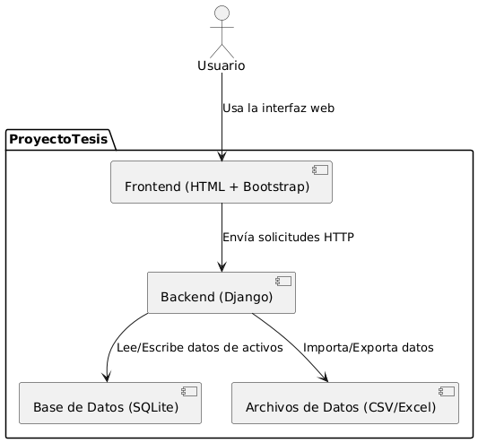
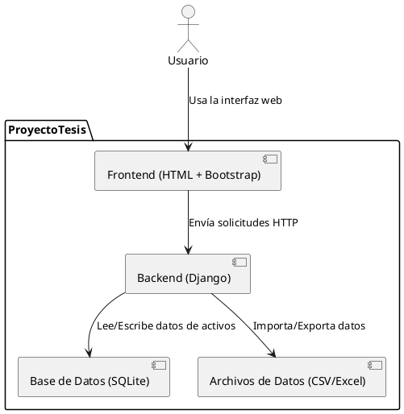

# ProyectoTesis

Este proyecto es una plataforma para la gestión de activos, desarrollada con Django para el backend y una estructura de frontend basada en templates HTML. Incluye manejo de datos y una arquitectura modular.

## Estructura del Proyecto

```
ProyectoTesis/
│
├── backend/         # Proyecto Django
│   ├── manage.py
│   ├── activos/     # App principal para gestión de activos
│   └── config/      # Configuración del proyecto Django
│
├── frontend/        # Archivos estáticos y templates
│   ├── templates/   # HTML para la interfaz de usuario
│
├── data/            # Archivos de datos (CSV, Excel)
│   ├── data.csv
│   └── data.xlsx
│
├── requirements.txt # Dependencias del proyecto
└── README.md        # Este archivo
```

## Descripción

La aplicación permite gestionar activos, almacenando información relevante como tipo, nombre, ubicación, cantidad y código. Utiliza Django como framework principal y organiza la lógica en una app llamada `activos`. 

El frontend está construido con templates HTML y utiliza el framework de estilos Bootstrap para una interfaz moderna y responsiva.

## Instalación

1. Clona el repositorio:
   ```bash
   git clone https://github.com/N0D3TR4CK3R/ProyectoTesis.git
   cd ProyectoTesis
   ```
2. Crea y activa un entorno virtual (opcional pero recomendado):
   ```bash
   python -m venv venv
   # En Windows:
   venv\Scripts\activate
   # En Linux/Mac:
   source venv/bin/activate
   ```
3. Instala las dependencias:
   ```bash
   pip install -r requirements.txt
   ```
4. Aplica migraciones y ejecuta el servidor:
   ```bash
   cd backend
   python manage.py migrate
   python manage.py runserver
   ```

## Uso

- Accede a la interfaz web en `http://127.0.0.1:8000/`.
- Gestiona activos desde la app principal.
- Los datos pueden ser exportados/importados desde la carpeta `data/`.

## Arquitectura

El proyecto sigue una arquitectura modular:
- **Backend:** Django, app `activos`, base de datos SQLite.
- **Frontend:** Templates HTML con Bootstrap.
- **Datos:** Archivos CSV y Excel.

## Diagrama de Arquitectura

A continuación se muestra el diagrama de arquitectura generado:



También puedes encontrar el diagrama en formato PlantUML (puedes copiarlo y visualizarlo en PlantUML Online Server):



---

Si tienes dudas o sugerencias, contacta al autor del repositorio. 